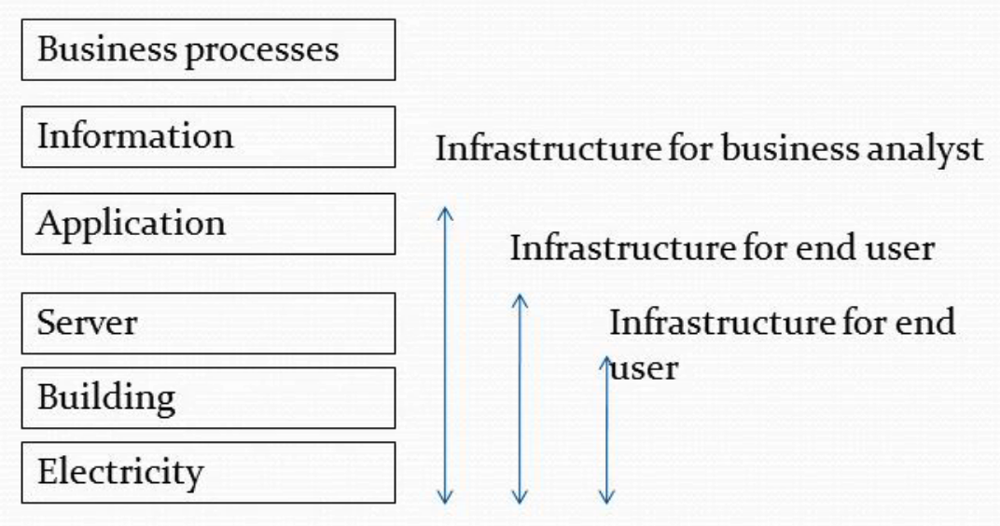

IT infrastructures are the substrate on which user applications run 
[[traugott98]](#traugott98). Without the users' need for applications, we wouldn't 
have to build them. In many cases, it is the success of a user application
that leads to infrastructure growth.[^1]

[^1]: I wonder if there are examples of the converse, 
    an application ecosystem growing because of the success of 
    successful infrastructure. Keep in mind that what _infrastructure_ is a 
    relative term, and it's usually to refer to those applications that support your 
    work. 

    

A while back I stumbled upon Traugott's article
[Bootstrapping an infrastructure](#traugott98), the article contains many ideas that 
are considered good practices today. I was not able to find direct connections 
the contemporary terminology and Traugott's article, so I decided to write this post 
and attempt to connect those ideas with their contemporary incarnations. 

## Generic, replaceable components, disaster recovery

In Traugott's words:

> ...although the components of an infrastructure are more or less standard,
> professional architects tend to arrange them in radically different ways.

- When each component is generic, and there's enough automation, it's easy to destroy a
  misbehaving component and recreate it from a trusted source. 
- A benefit of this is shorter time to recover from certain types of disasters, and can
  also protect against compromised components. 
- Applications need to support this behavior and be able to function properly after
  their host is terminated while in the middle of an operation
- it's easier to fix machines when they fail if they are generic, it's hard when each 
  is configured in a unique way
  - it's easier to fix when the configuration is code, it's hard if it was done ad-hoc
- makes it easy for users to learn, since everything is in teh same place on every host
- 28. it's easier to replace existing components with new generic ones, than to adapt
      the old ones to the new way of working
1. retrofiting updates to old systems is more work than building a new system
2. rebuilding is less effort than updating existing systems without automation, i.
       e., via ad-hoc changes
3. enables building lower environments that are very close to a productive one, which 
   may come in handy in certain disaster recovery scenarios, when the lower env is 
   used as a hot standby for the productive infrastructure

## Dependency diagram

4. diagram of the boot sequence, maybe a simplified version of it?
5. the boot sequence can be inverted, deriving the need for each component from the
   client needs/requirements, as opposed of building from the bottom up. This is a
   recurring theme, whether to model the infra from the bottom up or from the top down,
   has implication in its management and the assumption around autonomy and control.
    1. with top bottom, we focus on control, at the expense of autonomy ................
    2. with bottom up, we focus on flexibility and autonomy, at the expense of
       duplication and drift

## Benefits of textual representation, i.e. code

- composability
- I need to talk about the need to use code, before I can make the case that software
  practices are relevant
- maybe making it like this: what you care is the state, state can be captured in
  config files, which are textual, therefore the dev tools, which are optimized for
  text fit pretty well, after all confi files are a form of code

## IT infrastructure evolves
    
- Infrastructure will change, it needs to constantly adapt to the needs of its users
- the ability to trace the evolution of an infrastructure gives you the possibility to
  learn from the past and make better decisions in the future
- version controls fills the need to keep a historical record of all the changes
  made to the infrastructure
- 41. version control facilitates the evolution of infrastructure
      and also having different versions of its
1. creating and destruction of entire Infrastructures becomes
   more manageable than doing it by hand
2. having a /master/ version of configuration files is good, it
   can be used as a baseline and then adapted to satisfy the
   needs of other infrastructures

## Avoiding manual/ad-hoc changes

- avoid making ad-hoc changes and prefer updating the template/golden server, then let 
  changes propagate
  - you can help yourself by creating **immutable components**, making it harder to 
    change running components than updating the source code
  - writing and debugging a script is less than the time it takes to change hundreds of 
    clients manually
- it forces you to make all changes to the code that generates the infra, therefore
  pushes you in the direction of All changes are code
- if you have no custom/ad-hoc changes in any of your components then you can
  destroy them and recreate without losing valuable work
- ad-hoc changes can fix some bugs faster
- regular use of ad-hoc changes creates more labor, labor means cost
- ad-hoc changes generate drift
- iac allows linearly growing team to manage exponentially growing infrastructures,
      reduction of labor means reduction of cost

## Code is Automation

- encoding desired state/behaviour is a form of automation
- automatation enables to execute tasks in a repeatable manner, reducing human effort
- automation is more expensive for smaller infras, but it pays off when:
    - the infra is big
    - it changes a lot
    - the effects of drift are too heavy

## Software Defined XXX

- software is increasingly being used to do more things, including the creation of
  virtualized infra components
- it's cheaper, faster to evolve, automate, etc

## Centralization, pull-based workflows

- clients know when it's the best time to pull updates
- clients are responsible for staying updated
- having a central place (canonical name) to refer to infra resources is still very
  much beneficial
    - centralized names (dns) does not mean single point of failure, the gold server 
      is not mission critical, it being down does not impact the users of the infrastructure
- gold server is passive
- pull methods scale better, the compute needed is distributed to the clients, no
      need for a central powerful node to push changes to however many nodes you have
- having autonomous clients, and pull based workflows does not make the idea of
    centralized artefact repositories/servers irrelevant

## Gold server vs Golden Server

- one is a repository of artefacts, code, configurations, etc
- the gold server enables re-use, by hosting re-usable components, such as templates
- the other represent a code/conf template to create a specific component
- the golden server enables repeatability, reducing deviations

## Infrastructure architecture
    
- architecture: durability, utility, beauty
    - https://en.wikipedia.org/wiki/Architecture#Theory_of_architecture
- opinion: identifying patterns of interconnection between components

## Notoriously absent: monitoring

1. Systems infrastructure: somehow the network is taken for granted, there's almost no
   mention of the network setup
- the author says that somehow it was not fully implemented
- that casts some doubts in my mind about how ready for prod this was for todays 
  standards where auditing relies so heavily on monitoring and logging of special events

## Career rant

47. Rant about job titles
    1. I resonate with the following quotes
    2. add a personal commentary on each quote
36. there was a time were infra archs were not a thing, many times is equated with a
    senior sysadmin, who can flip tapes faster
37. Recruiters generally don’t even know what an ‘‘infrastructure architect’’ is, and far
    too often assume that ‘‘senior sysadmin’’ means you know how to flip tapes faster.
38. Most of us at one time or another have been restricted from improving a broken
    infras- tructure, simply because it didn’t fit within our job description.
39. Some of the most capable systems administrators we’ve known are not interested in
    coding
    1. different mindsets/interests: those who want hands on work and don’t mind
       repetition, and those who hate repetition
40. infrastructure architects tend to spend most of their time writing code. They are
    motivated by challenges and impatience – they hate doing the same thing twice

## Multiple DCs: private and public

2. Thinking of an infrastructure as a Virtual Machine, rather than a collection of
   individual hosts
42. wholistic thinking: the whole DC(s) as a single VM
    1. this is the idea I would like to extend to multiple dcs with different
       operating models: IaaS, SaaS, PaaS, DBaaS, etc.

44. centrally managed infra vs self-service infra
    the article seems to assume that there's a single infra that
    servres all apps, but today it's easier than ever to provision
    certain kinds of infra, e.g., vpc, vms, containers, vmis,
    however a central place for governance (global policies) still
    has a place as part of the centrally controlled infrastructure

46. ask questions about exending the ideas here to cover
    operating in a multi-cloud environment, where the
    private/on-premise DC is just one of many DCs, and in which
    each DC has different operational models, e.g., public cloud
    providers offer different methods of interaction, namely,
    IaaS, PaaS, SaaS, etc.

## Configuration Management

43. convergence vs congruence, declarative vs procedural #cm-burgess
    1. even when you write declarative code, the implementation has to start from a
       known state, and calculate the sequence of actions to execute, so as a user of
       the tool, you may not have to write declarative code but as teh developer of the
       tool you must definitely must

## Ownership, central teams, autonomy and duplication of effort

48. finding principles to determine the ownership of specific infrastructure resources
    1. i find it difficult to tradeoff the benefits of autonomous decentralized teams
       and the duplication of effort it produces
    2. i would like to find some principles that help guide the decision on when to
       consolidate multiple distinct solutions to the same problem into a centralized
       standardized approach

## Diagrams

1. Boot sequence: [link](../assets/diagram/boot-sequence.puml), dependency between tasks
   when
   bootstrapping an infra
2. Principles for building
   infrastructures: [link](../assets/diagram/building-infrastructure.puml)
   The idea is to derive each of the key ideas/concepts in the article from first
   principles, that should be accepted as self-evident

## Related

1. Traugott, S. and Joel Huddleston. <a name="traugott98">Bootstrapping an 
   Infrastructure. LISA (1998).</a>
    - [Semantic Scholar - CorpusID:30764312](https://api.semanticscholar.org/CorpusID:30764312)
    - [infrastructures.org - papers](http://www.infrastructures.org/papers/bootstrap/bootstrap.html)
    - [usenix.org - Abstracts - 12th Systems Administration Conference (LISA '98)](https://www.usenix.org/legacy/publications/library/proceedings/lisa98/traugott.html)
2. [infrastructures.org](http://www.infrastructures.org) (_Retrieved on 2022-09-04 20:59_)
3. Burgess, Mark, <a name="cm-burgess" href="http://markburgess.org/cm.html"> 
   Configuration management, models and myths</a>.
   (_Retrieved on 2022-09-04 20:38_)

## Footnotes
