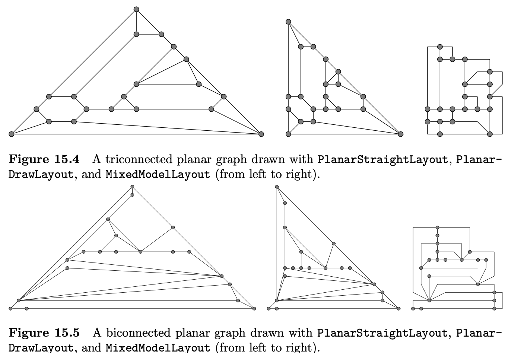

I use [PlantUML](https://plantuml.com/) to visualize software components or ideas for 
blog posts. Often, the layout becomes unwieldy and a lot of time goes into 
tweaking it. This post is about the current state of diagram 
layouts when using PlantUML.


## Bad layouts can make diagrams unusable 

Producing good-looking diagrams using PlantUML is notoriously difficult; this has been 
known for a while, e.g.,

1. <a id="gv-not-good" href="https://forum.plantuml.net/4842/graphviz-is-not-good-enough">
    Graphviz is not good enough:
   </a>
   the original poster seems to think that the issue lies in the underlying graph 
   drawing tool, namely [Graphviz](https://graphviz.org/), a mature (30+ years old) graph 
   visualization package. He suggests that by using the
   [Open Graph Drawing Framework (OGDF)](https://ogdf.uos.de/), PlantUML could generate 
   better layouts. 

2. [Diagrams are a mess](https://github.com/plantuml/plantuml/issues/13): shows an 
   example of how the diagram becomes a _mess_ due to the 
   terrible layout. It seems that this happens more 
   often for diagrams with edge crossings, sometimes referred to as 
   [_non-planar graphs_](https://en.wikipedia.org/wiki/Planar_graph), that just means 
   that they cannot be drawn on a plane without edge crossings.


## What is the problem with PlantUML's layouts?

I have tried to understand the problem and see how hard it would be to improve the
situation. I expected that it would not be trivial, otherwise it would have been
done already.

It seems that the issue could arise due to the layout
options that PlantUML uses when interacting with Graphviz, however, it's not super clear 
to me how this happens. I can think of the following possibilities:

1. Graphviz itself cannot produce better layouts. Somehow I doubt that this is the case 
   given the maturity of the library. However, it remains a possibility that 
   modern layout algorithms are not part of Graphviz.
2. Graphviz can produce better layouts but PlantUML instructs Graphviz to draw the 
   diagram using options that result in a suboptimal layout. This seems plausible 
   given that diagrams created with OGDF can be [drawn using Graphviz](#draw-ogdf-gv). 


## The Open Graph Drawing Framework (OGDF) 

The layout examples in the [OGDF pre-print](../assets/pdf/ogdf-pre-preprint.pdf) are 
quite impressive: 



When using the OGDF C++ framework, graphs are defined via building the required data 
structures like a [Graph](https://ogdf.github.io/doc/ogdf/classogdf_1_1_graph.html), 
[GraphAttributes](https://ogdf.github.io/doc/ogdf/classogdf_1_1_graph_attributes.html), 
then it's possible to apply different types of 
[layouts](https://ogdf.github.io/doc/ogdf/classogdf_1_1_layout_module.html). Here's a 
simplified example of what the process of building a graph 
([full example](https://ogdf.github.io/doc/ogdf/ex-layout.html)):


Graph G;
GraphAttributes GA(G, 
    GraphAttributes::nodeGraphics | 
    GraphAttributes::nodeTemplate);

SugiyamaLayout SL;
SL.setRanking(new OptimalRanking);
SL.setCrossMin(new MedianHeuristic);

OptimalHierarchyLayout *ohl = new OptimalHierarchyLayout;
SL.setLayout(ohl);

SL.call(GA);

GraphIO::write(GA, "output.gml", GraphIO::writeGML);
GraphIO::write(GA, "output.svg", GraphIO::drawSVG);



### Drawing an OGDF diagram with Graphviz <a id="draw-ogdf-gv"></a>

OGDF can generate output in GML and SVG formats. SVG files can be opened by 
any modern web browser, for GML files I needed to use 
[gml2gv](https://graphviz.org/docs/cli/gml2gv/) to convert them to 
[DOT](https://graphviz.org/doc/info/lang.html) 
files and eventually into SVG files using 
[dot](https://graphviz.org/doc/info/command.html), both utilities are part of Graphviz:

```shell
# Convert GML into DOT 
gml2gv -o graph.dot graph.gml

# Convert DOT into SVG
dot -Tsvg graph.dot > graph.svg
```

This is what makes me think that the issues with PlantUML layouts may not be due to 
Graphviz.

<a name="gotchas" href=""></a>
#### GOTCHAs generating SVG files

I didn't spend much time investigating this, but I ran into two problems while playing 
around with OGDF trying to generate SVG files from the code examples:

1. not all GML files can be converted to DOT files, some syntax error
2. sometimes OGDF will refuse to create an SVG file if 
   some conditions are not met, e.g., there are edge crossings


### Loading GML files to customize the layout

The OGDF sources have examples showing how to load a GML file, customize the layout 
and then generate a GML or SVG file for the updated diagram. This is roughly the 
approach suggested in [Graphviz is not good enough](#gv-not-good), namely, to extend 
PlantUML so that it can generate GML files as output and use OGDF to 
improve the layout afterwards. Just a reminder here that not all GML files can be 
converted to DOT files, see [GOTCHAS](#gotchas).


## PlantUML layout hints

PlantUML does provide 
[specific syntax to control the layout](https://crashedmind.github.io/PlantUMLHitchhikersGuide/layout/layout.html) 
for some elements in a diagram, however, there are
times when these layout _hints_ are ignored, others where the result is not very good, 
and sometimes their effects are not intuitive.


## How I deal with PlantUML's layout limitations

In my experience, making multiple smaller focused diagrams plus 
tweaking the layout pays off quicker than creating a 
more complex diagram and then tweaking its layout. The time spent tweaking the layout 
of a diagram grows faster than linearly with respect to the number of elements shown.

This is a nice exercise in diagram making, since it forces me to really refine it and 
only show those elements that are truly relevant.


### Accuracy and simplicity: a diagram's goal

I also try to be more conscious about my goals: am I trying
to show an accurate picture, or to emphasize one important thing? Some diagrams are 
only really useful if they are accurate, but in other cases, sacrificing accuracy to 
bring attention to the really important stuff really pays off. When in doubt, make 
multiple versions of the diagram, PlantUML makes this super easy. 


## Possible paths to improve diagram layouts

Given my limited knowledge of the tools involved, there are a couple options I can
think of on how to improve the layouts generated by PlantUML:

1. Extend PlantUML so that Graphviz uses better layout options [^1]
2. Integrate PlantUML and OGDF [^2], that is, use the PlantUML syntax but create the 
   Graph using OGDF and let Graphviz draw the diagram, or OGDF export the GML/SVG files 
3. Extend PlantUML to generate GML files [^3] that can be post-processed with OGDF to 
   improve the layout and generate an updated GML/SVG file 

[^1]: Some investigation is required to learn when Graphviz can generate better layouts

[^2]: Requires knowledge on how to integrate a C++ library with the Java-based 
    PlantUML code base

[^3]: This is the approach suggested in [Graphviz is not good enough](#gv-not-good)


## Related links

<ol>
    <li>
        <a id="puml-site" 
            href="https://plantuml.com/en/">PlantUML website</a>
    </li> 
    
    <li>
    <a id="ref:gv-not-good"
        href="https://forum.plantuml.net/4842/graphviz-is-not-good-enough">
        PlantUML forum: Graphviz is not good enough
    </a>
    </li>
    
    <li>
    <a id="gh-puml-mess"
        href="https://github.com/plantuml/plantuml/issues/13">
        PlantUML GitHub issues: Diagrams are a mess
    </a>
    </li>
    
    <li>
    <a id="wiki-planar" 
        href="https://en.wikipedia.org/wiki/Planar_graph">
        Wikipedia: Planar graph
    </a>
    </li>
    
    <li>
    <a id="ogdf-site" 
        href="https://ogdf.uos.de/">Open Graph Drawing Framework</a>
    </li>
    
    <li>
    <a id="ogdf-gh-repo" 
        href="https://github.com/ogdf/ogdf">OGDF GitHub repo</a>
    </li>
    
    <li>
    <a id="puml-cli" 
        href="https://plantuml.com/de/command-line">
        PlantUML output formats
    </a>
    </li>
    
    <li>
    <a id="gv-site" 
        href="https://graphviz.org">Graphviz</a>
    </li>
    
    <li>
    <a id="dot-lang" 
        href="https://graphviz.org/doc/info/lang.html">DOT language</a>
    </li>
    
    <li>
    <a id="dot-cli" 
        href="https://graphviz.org/doc/info/command.html">dot command</a>
    </li>
    
    <li>
    <a id="gml2gv" 
        href="https://graphviz.org/docs/cli/gml2gv/">gml2gv command</a>
    </li>
    
    <li>
    <a id="puml-guide"
        href="https://crashedmind.github.io/PlantUMLHitchhikersGuide/layout/layout.html">
        PlantUML Hitchhiker's guide
    </a>
    </li>
</ol>


## Footnotes
